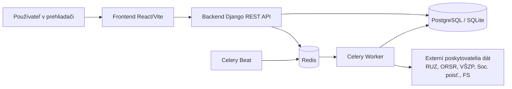

# CistaFirma.sk

> Moderná platforma na overovanie firiem, rizík, dlhov a registrových dát na Slovensku.

Monorepo obsahuje backend (Django + DRF), frontend (React + Vite), asynchrónne spracovanie (Celery) a deployment tooling (Docker Compose, Kubernetes, Helm, GitLab CI/CD).

## Prečo tento projekt

`cistafirma` spája verejne dostupné zdroje (RUZ, ORSR, poisťovne, FS dáta) do jedného workflow pre rýchle preverenie firmy podľa IČO alebo názvu. Cieľom je dať návštevníkovi jasný a rýchly pohľad na:

- základné profilové údaje firmy,
- finančné výsledky,
- signály rizika a dlhy,
- historické a synchronizačné metadáta.

## Systém na 10 sekúnd



## Štruktúra monorepa

| Adresár | Popis |
|---|---|
| `backend/` | Django projekt (`users`, `companies`, `registers`, `subscriptions`, `analyses`, `adminapi`) |
| `frontend/` | React + TypeScript UI |
| `deploy/helm/cistafirma/` | Helm chart (backend, frontend, worker, beat, ingress, migračný job) |
| `deploy/k8s/` | Kustomize layout (base + overlays pre dev/prod) |
| `scripts/k8s/` | Deployment, migrácia, backup/restore, rollback skripty |
| `docs/` | Centrálna dokumentácia pre vývojárov a DevOps |

## Rýchly štart (lokálne)

### 1) Príprava konfigurácie

```bash
# z root adresára projektu
cp .env.default .env
```

### 2) Spustenie celého stacku cez Docker Compose

```bash
docker compose up -d
docker compose ps
```

Predvolené endpointy:

| Služba | URL |
|---|---|
| Frontend | `http://localhost:5173/` |
| Backend API | `http://localhost:8080/api/` |
| Admin | `http://localhost:8080/admin/` |
| Healthcheck | `http://localhost:8080/healthz/` |

### 3) Základné overenie

```bash
curl http://localhost:8080/healthz/
curl "http://localhost:8080/api/companies/search/?q=MARO"
```

## Dokumentácia

Kompletný dokumentačný hub je v [`docs/README.md`](docs/README.md).

| Dokument | Popis |
|---|---|
| [`docs/ARCHITECTURE.md`](docs/ARCHITECTURE.md) | Systémová architektúra, komponenty, async pipeline |
| [`docs/API_REFERENCE.md`](docs/API_REFERENCE.md) | API endpointy, auth flow, príklady |
| [`docs/DEVELOPER_GUIDE.md`](docs/DEVELOPER_GUIDE.md) | Lokálny setup, vývojový workflow, testovanie |
| [`docs/DEPLOYMENT_RUNBOOK.md`](docs/DEPLOYMENT_RUNBOOK.md) | Operačný deploy/rollback postup, incident triage |
| [`docs/DEVOPS_CICD.md`](docs/DEVOPS_CICD.md) | CI/CD pipeline, branch/tag stratégia |
| [`deploy/helm/cistafirma/README.md`](deploy/helm/cistafirma/README.md) | Helm chart dokumentácia |
| [`deploy/k8s/README.md`](deploy/k8s/README.md) | Kubernetes deployment |

## CI/CD v skratke

| Fáza | Čo robí |
|---|---|
| `validate` | Backend compile, frontend build, Helm render + K8s dry-run validácie, docs audit |
| `test` | Django test suite |
| `build` | Build a push backend + frontend Docker image |
| `deploy` | Auto deploy do dev z `dev` vetvy; manuálny prod deploy z `v*` tagov |

Podrobnosti: [`docs/DEVOPS_CICD.md`](docs/DEVOPS_CICD.md)

## Technológie

| Vrstva | Stack |
|---|---|
| Backend | Django 6, Django REST Framework, SimpleJWT, Celery, django-celery-beat |
| Dátová vrstva | PostgreSQL (produkcia), SQLite fallback (lokálne), Redis broker/backend |
| Frontend | React 19, Vite, TypeScript, Recharts |
| Deploy | Docker Compose, Helm 3, Kubernetes, GitLab CI |

## Pre vývojárov

- Setup a workflow: [`docs/DEVELOPER_GUIDE.md`](docs/DEVELOPER_GUIDE.md)
- API endpointy a príklady: [`docs/API_REFERENCE.md`](docs/API_REFERENCE.md)
- Async úlohy a synchronizácia dát: [`docs/ARCHITECTURE.md`](docs/ARCHITECTURE.md)

## Prispievanie

- Pravidlá prispievania: [`docs/GITFLOW.md`](docs/GITFLOW.md)
- PR/MR checklist: [`.gitlab/merge_request_templates/Default.md`](.gitlab/merge_request_templates/Default.md)
- Archív dokumentácie: [`docs/archive/README.md`](docs/archive/README.md)

## Audit dokumentácie

Pred väčším MR alebo releaseom odporúčame skontrolovať konzistenciu dokumentácie:

```bash
# z root adresára projektu
make docs-audit
```

## Stav repozitára

Projekt je aktívne rozpracovaný. Pri zavádzaní zmien odporúčame:

1. spustiť lokálne validácie,
2. skontrolovať Helm render + dry-run,
3. až potom push do CI pipeline.
