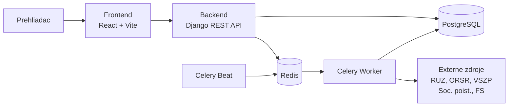

<div align="center">

# 🏢 cistafirma.sk

**Moderná platforma na overovanie firiem, rizík, dlhov a registrových dát na Slovensku.**

[](https://www.djangoproject.com/)
[](https://react.dev/)
[](https://www.typescriptlang.org/)
[](https://kubernetes.io/)
[](https://helm.sh/)
[](LICENSE)

---

Spája verejne dostupné zdroje — **RUZ**, **ORSR**, **poisťovne**, **Finančná správa** — do jedného workflow.  
Rýchle preverenie firmy podľa **IČO** alebo **názvu** s jasným prehľadom o rizikách.

</div>

---

## ✨ Čo ponúka

<table>
<tr>
<td width="25%" align="center">

**📋 Profil firmy**

Základné údaje, štatutári, sídlo, história

</td>
<td width="25%" align="center">

**📊 Financie**

Výsledky hospodárenia, účtovné závierky

</td>
<td width="25%" align="center">

**⚠️ Rizikové signály**

Dlhy, poistné nedoplatky, varovania

</td>
<td width="25%" align="center">

**🔄 Živé dáta**

Automatická synchronizácia z registrov

</td>
</tr>
</table>

---

## 🏗️ Architektúra



---

## 📁 Štruktúra monorepa

```
cistafirma/
├── backend/                 Django projekt
│   ├── companies/           Firemné profily, vyhľadávanie
│   ├── registers/           Integrácie s externými registrami
│   ├── users/               Autentifikácia (email + JWT)
│   ├── subscriptions/       Predplatné a prístupové plány
│   ├── analyses/            Rizikové skórovanie
│   └── adminapi/            Admin rozhranie
│
├── frontend/                React 19 · TypeScript · Vite SPA
│
├── deploy/
│   ├── helm/cistafirma/     Helm chart
│   └── k8s/                 Kustomize (base + dev/prod overlay)
│
├── scripts/k8s/             Deploy, migrácia, backup skripty
└── docs/                    Dokumentácia
```

---

## 🚀 Rýchly štart

### Predpoklady

> Docker a Docker Compose nainštalované na systéme.

### 1. Konfigurácia

```bash
cp .env.default .env        # Uprav podľa potreby
```

### 2. Spustenie

```bash
docker compose up -d
docker compose ps            # Over, či všetko beží
```

### 3. Overenie

```bash
curl http://localhost:8080/healthz/
curl "http://localhost:8080/api/companies/search/?q=MARO"
```

### Predvolené endpointy

| Služba | Adresa |
|:---|:---|
| **Frontend** | [`localhost:5173`](http://localhost:5173/) |
| **API** | [`localhost:8080/api/`](http://localhost:8080/api/) |
| **Admin** | [`localhost:8080/admin/`](http://localhost:8080/admin/) |
| **Healthcheck** | [`localhost:8080/healthz/`](http://localhost:8080/healthz/) |

---

## 🛠️ Technológie

| Vrstva | Technológie |
|:---|:---|
| **Backend** | Django 6 · DRF · SimpleJWT · Celery · django-celery-beat |
| **Dáta** | PostgreSQL (prod) · SQLite (lokálne) · Redis (broker + cache) |
| **Frontend** | React 19 · Vite · TypeScript · Recharts |
| **Infraštruktúra** | Docker Compose · Helm 3 · Kubernetes · GitLab CI/CD |

---

## 🔄 CI/CD Pipeline

```
  validate        test          build         deploy
┌──────────┐  ┌──────────┐  ┌──────────┐  ┌──────────┐
│ compile  │  │  Django   │  │  Docker  │  │ dev auto │
│ build    │──│  test     │──│  images  │──│ prod tag │
│ lint     │  │  suite    │  │  push    │  │ (manual) │
└──────────┘  └──────────┘  └──────────┘  └──────────┘
```

> **`dev`** vetva → automatický deploy · **`v*.*.*`** tag → manuálny produkčný deploy

---

## 📚 Dokumentácia

| | Dokument | Popis |
|:---|:---|:---|
| 🏛️ | [Architektúra](docs/ARCHITECTURE.md) | Systémové komponenty, async pipeline |
| 🔌 | [API referencia](docs/API_REFERENCE.md) | Endpointy, auth flow, príklady |
| 👨‍💻 | [Developer guide](docs/DEVELOPER_GUIDE.md) | Lokálny setup, workflow, testovanie |
| 🚢 | [Deployment runbook](docs/DEPLOYMENT_RUNBOOK.md) | Deploy, rollback, incident triage |
| ⚙️ | [CI/CD](docs/DEVOPS_CICD.md) | Pipeline, branch a tag stratégia |
| ☸️ | [Helm chart](deploy/helm/cistafirma/README.md) | Chart konfigurácia a values |
| 📦 | [Kubernetes](deploy/k8s/README.md) | Kustomize deployment |
| 🌿 | [Git workflow](docs/GITFLOW.md) | Pravidlá prispievania |

---

## 🧪 Audit dokumentácie

Pred väčším MR alebo releaseom skontroluj konzistenciu:

```bash
make docs-audit
```

---

## 🤝 Prispievanie

1. Prečítaj si [Git workflow](docs/GITFLOW.md)
2. Použi [MR šablónu](.gitlab/merge_request_templates/Default.md)
3. Spusti lokálne validácie pred pushom
4. Skontroluj Helm render + dry-run

---

<div align="center">

**cistafirma.sk** · Overuj firmy s istotou.

</div>
