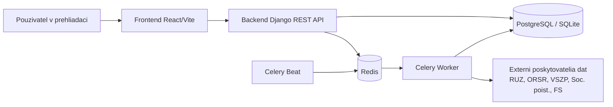

# CistaFirma.sk

> Modernna platforma na overovanie firiem, rizik, dlhov a registrovych dat.

Monorepo obsahuje backend (Django + DRF), frontend (React + Vite), asynchrone spracovanie (Celery) a deployment tooling (Docker Compose, Kubernetes, Helm, GitLab CI/CD).

## Preco tento projekt

`cistafirma` spaja verejne dostupne zdroje (RUZ, ORSR, poistovne, FS data) do jedneho workflowu pre rychle preverenie firmy podla ICO alebo nazvu. Cielom je dat navstevnikovi jasny a rychly pohlad na:

- zakladne profilove udaje firmy,
- financne vysledky,
- signaly rizika a dlhy,
- historicke a synchronizacne metadate.

## System na 10 sekund



## Monorepo struktura

- `backend/` - Django projekt (`users`, `companies`, `registers`, `subscriptions`, `analyses`)
- `frontend/` - React + TypeScript UI
- `deploy/helm/cistafirma/` - Helm chart (backend, frontend, worker, beat, ingress, migrate job)
- `deploy/k8s/` - Kustomize layout (base + overlays)
- `scripts/k8s/` - deployment, migracia, backup/restore, rollback utility skripty
- `docs/` - centralna dokumentacia pre vyvojarov a DevOps

## Rychly start (lokalne)

### 1) Priprava konfiguracie

```bash
cd /Users/samuelsugra/Code/cistafirma
cp .env.default .env
```

### 2) Spustenie celeho stacku cez Docker Compose

```bash
docker compose up -d
docker compose ps
```

Predvolene endpointy:

- Frontend: `http://localhost:5173/`
- Backend API: `http://localhost:8080/api/`
- Admin: `http://localhost:8080/admin/`
- Healthcheck: `http://localhost:8080/healthz/`

### 3) Zakladne overenie

```bash
curl http://localhost:8080/healthz/
curl "http://localhost:8080/api/companies/search/?q=MARO"
```

## Dokumentacia

Kompletny dokumentacny hub je v [`docs/README.md`](docs/README.md).

Najdolezitejsie odkazy:

- Architektura: [`docs/ARCHITECTURE.md`](docs/ARCHITECTURE.md)
- API referencia: [`docs/API_REFERENCE.md`](docs/API_REFERENCE.md)
- Vyvojarsky guide: [`docs/DEVELOPER_GUIDE.md`](docs/DEVELOPER_GUIDE.md)
- Deployment runbook: [`docs/DEPLOYMENT_RUNBOOK.md`](docs/DEPLOYMENT_RUNBOOK.md)
- CI/CD a release flow: [`docs/DEVOPS_CICD.md`](docs/DEVOPS_CICD.md)
- Helm chart: [`deploy/helm/cistafirma/README.md`](deploy/helm/cistafirma/README.md)
- Kubernetes deployment: [`deploy/k8s/README.md`](deploy/k8s/README.md)

## CI/CD v skratke

- `validate`: backend compile, frontend build, Helm render + K8s dry-run validacie
- `test`: Django test suite
- `build`: build/push backend + frontend image
- `deploy`: auto dev deploy z `dev` branch, manual prod deploy z `v*` tagov

Podrobnosti: [`docs/DEVOPS_CICD.md`](docs/DEVOPS_CICD.md)

## Technologie

- Backend: Django 6, Django REST Framework, SimpleJWT, Celery, django-celery-beat
- Data store: PostgreSQL (prod), SQLite fallback (lokal), Redis broker/backend
- Frontend: React 19, Vite, TypeScript, Recharts
- Deploy: Docker Compose, Helm 3, Kubernetes, GitLab CI

## Pre vyvojarov

- setup a workflow: [`docs/DEVELOPER_GUIDE.md`](docs/DEVELOPER_GUIDE.md)
- API endpointy a priklady: [`docs/API_REFERENCE.md`](docs/API_REFERENCE.md)
- async ulohy a synchronizacia dat: [`docs/ARCHITECTURE.md`](docs/ARCHITECTURE.md)

## Prispievanie

- pravidla prispievania: [`CONTRIBUTING.md`](CONTRIBUTING.md)
- PR/MR checklist: [`.gitlab/merge_request_templates/Default.md`](.gitlab/merge_request_templates/Default.md)
- archiv dokumentacie: [`docs/archive/README.md`](docs/archive/README.md)

## Release-ready docs audit

Pred vacsim MR/release odporucame skontrolovat konzistenciu dokumentacie:

```bash
cd /Users/samuelsugra/Code/cistafirma
make docs-audit
```

## Poznamka k stavu repozitara

Projekt je aktivne rozpracovany. Pri zavadzani zmien odporucame:

1. spustit lokalne validacie,
2. skontrolovat Helm render + dry-run,
3. az potom push do CI pipeline.
