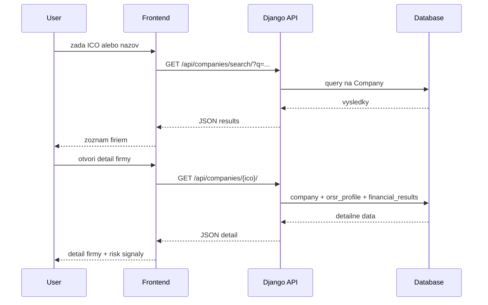

# Architektura

Tento dokument popisuje logicku aj runtime architekturu projektu `cistafirma`.

## 1. Logicke komponenty

- `frontend/` - React aplikacia, ktora vola backend cez `/api`
- `backend/` - Django + DRF API, admin, auth, business logika
- `registers` modul - synchronizacia dat z externych zdrojov a periodicke ulohy
- `companies` modul - read-only API pre vyhladavanie/detail firiem
- `users` modul - registracia, JWT token, profil pouzivatela
- Celery worker + beat - asynchronne vykonavanie a planovanie uloh
- Redis - broker/result backend pre Celery
- PostgreSQL (resp. SQLite fallback) - trvale ulozisko

## 2. Runtime topologia

## 3. Aplikacne moduly (backend)

### `users`

- JWT autentifikacia (`/api/auth/token/`, `/api/auth/token/refresh/`)
- registracia (`/api/auth/register/`)
- profil (`/api/auth/profile/`)

### `companies`

- list/search/detail endpointy pre firmy (`/api/companies/`)
- lookup podla `ico`
- agregovany detail vratane ORSR profilu a financnych vysledkov

### `registers`

- trigger endpointy pre manualne spustenie sync taskov
- Celery tasky pre RUZ, ORSR, financne vysledky, poistovne
- orchestrace full/incremental/repair sync flow

## 4. Data synchronizacia

Periodicke ulohy su definovane v `backend/backend/settings.py` cez `CELERY_BEAT_SCHEDULE`.

Aktualny planovac spusta najma:

- kontrolu dlhov v poistovniach
- inkrementalne stahovanie dat z RUZ
- aktualizaciu FS dat
- ORSR sync pre chybajuce profily
- RUZ financial sync

## 5. Vyhladavaci flow (request lifecycle)

## 6. Konfiguracia prostredia

- Root `.env` je centralny zdroj konfiguracie
- Backend nacitava najprv root `.env`, fallback na backend-specific `.env` subory
- Docker Compose mapuje backend na host port `8080`, frontend na `5173`

## 7. Design rozhodnutia

- **Monorepo**: spolocny release rytmus frontend/backend/deploy
- **Async pipeline**: heavy I/O synchronizacie mimo request-response cesty
- **K8s migrate-first deploy**: schema migracie pred rolloutom app deploymentov
- **API-first backend**: frontend zavisly na stabilnych DRF endpointoch

## 8. Rizikove miesta, na ktore mysliet

- data quality/external API availability (RUZ/ORSR)
- queue backlog pri vacsom sync jobe
- schema zmeny vyzadujuce backward-compatible migracie
- konzistencia dokumentacie pri rychlych zmenach endpointov
