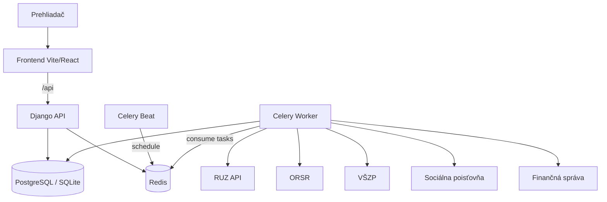
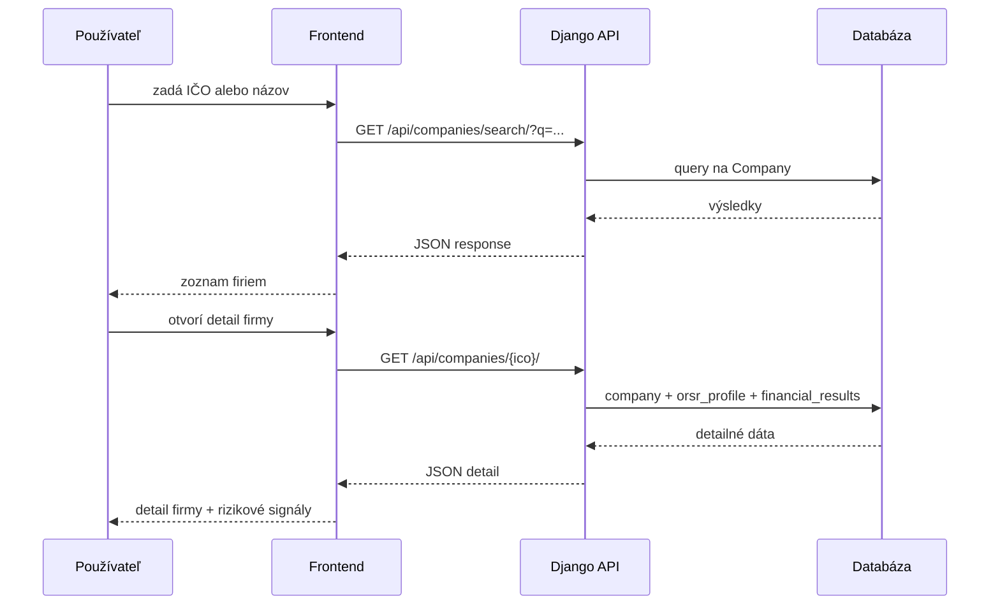

# Architektúra

Tento dokument popisuje logickú aj runtime architektúru projektu `cistafirma`.

## 1. Logické komponenty

- `frontend/` – React aplikácia, ktorá volá backend cez `/api`
- `backend/` – Django + DRF API, admin, auth, business logika
- `registers` modul – synchronizácia dát z externých zdrojov a periodické úlohy
- `companies` modul – read-only API pre vyhľadávanie/detail firiem
- `users` modul – registrácia, JWT token, profil používateľa
- Celery worker + beat – asynchrónne vykonávanie a plánovanie úloh
- Redis – broker/result backend pre Celery
- PostgreSQL (resp. SQLite fallback) – trvalé úložisko

## 2. Runtime topológia

## 3. Aplikačné moduly (backend)

### `users`

- JWT autentifikácia (`/api/auth/token/`, `/api/auth/token/refresh/`)
- Registrácia (`/api/auth/register/`)
- Profil (`/api/auth/profile/`)

### `companies`

- List/search/detail endpointy pre firmy (`/api/companies/`)
- Lookup podľa `ico`
- Agregovaný detail vrátane ORSR profilu a finančných výsledkov

### `registers`

- Trigger endpointy pre manuálne spustenie sync taskov
- Celery tasky pre RUZ, ORSR, finančné výsledky, poisťovne
- Orchestrácia full/incremental/repair sync flow

### `adminapi`

- Admin API endpointy (`/api/admin/`)
- `AuditLogMiddleware` pre logovanie admin operácií

## 4. Dátová synchronizácia

Periodické úlohy sú definované v `backend/backend/settings.py` cez `CELERY_BEAT_SCHEDULE`.

Queue layout (každá queue mapuje na samostatný Celery worker v K8s):

| Queue | Interval | Úloha |
|---|---|---|
| `ruz_full` | 6 h | Inkrementálne sťahovanie dát z RUZ |
| `orsr` | 4 h | ORSR sync pre chýbajúce profily |
| `financials` | 12 h | RUZ finančné výsledky per-company |
| `insurance` | 12 h | Kontrola dlhov v poisťovniach (VŠZP, Soc. poisťovňa) |
| `celery` (default) | 24 h | Aktualizácia FS dát, orchestračné a ad-hoc úlohy |

## 5. Vyhľadávací flow (request lifecycle)

## 6. Konfigurácia prostredia

- Root `.env` je centrálny zdroj konfigurácie.
- Backend načítava najprv root `.env`, fallback na backend-specific `.env` súbory.
- Docker Compose mapuje backend na host port `8080`, frontend na `5173`.

## 7. Dizajnové rozhodnutia

- **Monorepo** – spoločný release rytmus frontend/backend/deploy.
- **Async pipeline** – heavy I/O synchronizácie mimo request-response cesty.
- **K8s migrate-first deploy** – schéma migrácie pred rolloutom app deploymentov.
- **API-first backend** – frontend závislý na stabilných DRF endpointoch.

## 8. Rizikové miesta

- Kvalita dát / dostupnosť externých API (RUZ, ORSR).
- Queue backlog pri väčšom sync jobe.
- Schéma zmeny vyžadujúce backward-compatible migrácie.
- Konzistencia dokumentácie pri rýchlych zmenách endpointov.
