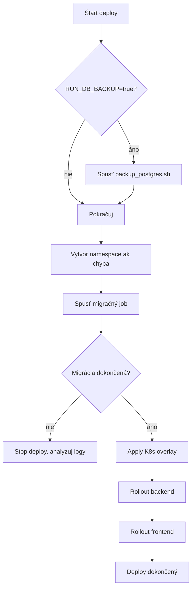

# Deployment Runbook

Praktický prevádzkový runbook pre nasadzovanie `cistafirma` do Kubernetes.

Tento dokument je orientovaný na reálne kroky pri release, rollbacku a riešení incidentov.

## 1. Predpoklady

- Funkčný `kubectl` context na cieľový cluster.
- Nastavené CI/CD premenné (`KUBE_CONFIG`, image registry credentials).
- Dostupné image tagy backend/frontend.
- Dostupný Kubernetes Secret (`cistafirma-secrets`).

## 2. Nasadenie – happy path

Používané skripty:

- `scripts/k8s/deploy.sh`
- `scripts/k8s/migrate.sh`

### Deployment flow



## 3. Manuálny deploy (mimo CI)

```bash
# z root adresára projektu
export BACKEND_IMAGE=registry.example.com/group/project/backend
export FRONTEND_IMAGE=registry.example.com/group/project/frontend
export DEPLOY_IMAGE_TAG=v1.0.0
export DEPLOY_ENV=prod
export K8S_NAMESPACE=cistafirma

scripts/k8s/deploy.sh
```

## 4. Rollback

Rollback skript: `scripts/k8s/rollback.sh`


Manuálny rollback:

```bash
# z root adresára projektu
export K8S_NAMESPACE=cistafirma
scripts/k8s/rollback.sh
```

## 5. Incident triage checklist

1. Over stav workloadov:

```bash
kubectl get pods -n cistafirma
kubectl get jobs -n cistafirma
kubectl get events -n cistafirma --sort-by=.metadata.creationTimestamp
```

2. Skontroluj migrate job logy:

```bash
kubectl logs job/<migrate-job-name> -n cistafirma
```

3. Skontroluj backend/frontend deployment detail:

```bash
kubectl describe deployment cistafirma-backend -n cistafirma
kubectl describe deployment cistafirma-frontend -n cistafirma
```

4. Ak treba, rollbackni app vrstvu. DB obnovuj iba keď je to nevyhnutné.

## 6. DB backup a restore

Skripty:

- `scripts/k8s/backup_postgres.sh`
- `scripts/k8s/restore_postgres.sh`

Príklad backup:

```bash
# z root adresára projektu
export DB_HOST=postgres-host
export DB_PORT=5432
export DB_NAME=cistafirma
export DB_USER=cistafirma
export DB_PASSWORD=secret
scripts/k8s/backup_postgres.sh
```

Príklad restore:

```bash
# z root adresára projektu
export DB_HOST=postgres-host
export DB_PORT=5432
export DB_NAME=cistafirma
export DB_USER=cistafirma
export DB_PASSWORD=secret
export BACKUP_FILE=./backups/cistafirma_YYYYMMDD_HHMMSS.dump
scripts/k8s/restore_postgres.sh
```

## 7. Release matrix

Viac v [DEVOPS_CICD.md](DEVOPS_CICD.md#release-matrix).

| Vetva / Tag | Správanie |
|---|---|
| `dev` branch | Automatický deploy do dev prostredia. |
| `main` branch | Build + príprava artefaktov; manuálny gate na dev deploy. |
| `vX.Y.Z` tag | Manuálny produkčný deploy gate. |

## 8. Operačné odporúčania

- Migrácie držať backward-compatible.
- Pred produkčným releaseom vždy overiť `helm lint` + dry-run validácie.
- Pri kritickom incidente preferovať rýchly app rollback pred riskantným DB restore.
- Zmenu runbooku robiť spolu so zmenou deploy skriptov.
