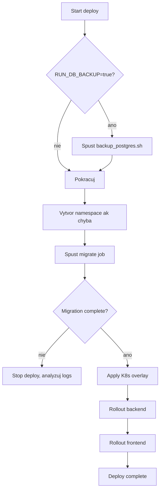
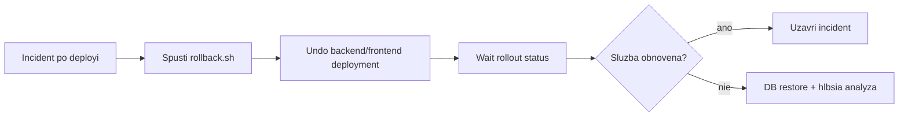

# Deployment Runbook

Prakticky prevadzkovy runbook pre nasadzovanie `cistafirma` do Kubernetes.

Tento dokument je orientovany na realne kroky pri release, rollbacku a rieseni incidentov.

## 1. Predpoklady

- funkcny `kubectl` context na cielovy cluster
- nastavene CI/CD premenne (`KUBE_CONFIG`, image registry creds)
- dostupne image tagy backend/frontend
- dostupny Kubernetes Secret (`cistafirma-secrets`)

## 2. Nasadenie - happy path

Pouzivane skripty:

- `scripts/k8s/deploy.sh`
- `scripts/k8s/migrate.sh`

### Deployment flow



## 3. Manualny deploy (mimo CI)

```bash
cd /Users/samuelsugra/Code/cistafirma
export BACKEND_IMAGE=registry.example.com/group/project/backend
export FRONTEND_IMAGE=registry.example.com/group/project/frontend
export DEPLOY_IMAGE_TAG=v1.0.0
export DEPLOY_ENV=prod
export K8S_NAMESPACE=cistafirma

scripts/k8s/deploy.sh
```

## 4. Rollback

Rollback skript:

- `scripts/k8s/rollback.sh`



Manualny rollback:

```bash
cd /Users/samuelsugra/Code/cistafirma
export K8S_NAMESPACE=cistafirma
scripts/k8s/rollback.sh
```

## 5. Incident triage checklist

1. Over status workloadov:

```bash
kubectl get pods -n cistafirma
kubectl get jobs -n cistafirma
kubectl get events -n cistafirma --sort-by=.metadata.creationTimestamp
```

2. Skontroluj migrate job logs:

```bash
kubectl logs job/<migrate-job-name> -n cistafirma
```

3. Skontroluj backend/frontend deployment detail:

```bash
kubectl describe deployment cistafirma-backend -n cistafirma
kubectl describe deployment cistafirma-frontend -n cistafirma
```

4. Ak treba rollbackni app vrstvu, DB obnovuj iba ked je to nevyhnutne.

## 6. DB backup a restore

Skripty:

- `scripts/k8s/backup_postgres.sh`
- `scripts/k8s/restore_postgres.sh`

Priklad backup:

```bash
cd /Users/samuelsugra/Code/cistafirma
export DB_HOST=postgres-host
export DB_PORT=5432
export DB_NAME=cistafirma
export DB_USER=cistafirma
export DB_PASSWORD=secret
scripts/k8s/backup_postgres.sh
```

Priklad restore:

```bash
cd /Users/samuelsugra/Code/cistafirma
export DB_HOST=postgres-host
export DB_PORT=5432
export DB_NAME=cistafirma
export DB_USER=cistafirma
export DB_PASSWORD=secret
export BACKUP_FILE=./backups/cistafirma_YYYYMMDD_HHMMSS.dump
scripts/k8s/restore_postgres.sh
```

## 7. Release matrix

- `dev` branch -> automaticky deploy do dev prostredia
- `main` branch -> build + priprava artefaktov
- `vX.Y.Z` tag -> manualny produkcny deploy gate

## 8. Operacne odporucania

- Migracie drzat backward-compatible.
- Pred produkcnym release vzdy overit `helm lint` + dry-run validacie.
- Pri kritickom incidente preferovat rychly app rollback pred riskantnym DB restore.
- Zmenu runbooku robit spolu so zmenou deploy skriptov.
