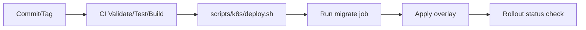

# Vývojársky sprievodca

Praktický guide pre vývojárov pracujúcich na monorepe `cistafirma`.

## 1. Predpoklady

- Docker Desktop + `docker compose`
- Node.js 20+
- Python 3.12+
- (voliteľne) `kubectl`, `helm` pre deployment validácie

## 2. Lokálny setup

### Krok 1: Konfigurácia prostredia

```bash
# z root adresára projektu
cp .env.default .env
```

### Krok 2: Spustenie služieb

```bash
docker compose up -d
docker compose ps
```

### Krok 3: Healthcheck a smoke test

```bash
curl http://localhost:8080/healthz/
curl "http://localhost:8080/api/companies/search/?q=MARO"
```

## 3. Vývojové workflow

### Backend zmeny

1. Uprav kód v `backend/`.
2. Spusti testy.
3. Over migrácie (ak meníš modely).
4. Over endpoint manuálnym requestom.

Príklad:

```bash
cd backend
python manage.py test --verbosity=1
```

### Frontend zmeny

```bash
cd frontend
npm install
npm run dev
npm run build
```

## 4. Asynchrónne úlohy (Celery)

Docker Compose spúšťa:

- `celery_worker_ruz`, `celery_worker_orsr`, `celery_worker_financials`, `celery_worker_insurance`, `celery_worker_default` – každý konzumuje vlastnú queue.
- `celery_beat` – scheduler periodických úloh.

Manuálne trigger endpointy:

- `/api/registers/trigger-ruz-fetch/`
- `/api/registers/trigger-insurance-debt-check/`
- `/api/registers/trigger-fs-update/`

## 5. CI quality gates

Pipeline (`.gitlab-ci.yml`) obsahuje:

| Job | Čo robí |
|---|---|
| `backend_validate` | Kontrola kompilácie |
| `frontend_validate` | Frontend build |
| `docs_audit` | Validácia Markdown odkazov |
| `helm_render_validate` | Helm lint + render dev/prod manifestov |
| `helm_runtime_validate` | Kontrola, že render má beat a všetkých päť workerov |
| `frontend_tests` | Vitest + typecheck |
| `backend_tests` | Django testy |

Pipeline beží na serveri **lenovo** (projektový runner `sam-lenovo`), nie na
vývojovom stroji. Ak joby ostávajú `pending`, je to takmer vždy preto, že
runner nemá `run_untagged = true` — pozri [`DEVOPS_CICD.md`](DEVOPS_CICD.md).

## 6. Deploy workflow

Nasadenie je **manuálne**, na produkčnom serveri `dell`:

```bash
cd <repo>
git pull gitlab-home <vetva>   # vždy menuj remote; over exit kód
docker compose up -d --build   # nikdy s -v
docker compose exec backend python manage.py migrate
```

`scripts/k8s/*.sh` a [`DEPLOYMENT_RUNBOOK.md`](DEPLOYMENT_RUNBOOK.md) patria
k **nenasadennej** K8s ceste — nepoužívaj ich, kým neexistuje klaster.



## 7. Najčastejšie príkazy

```bash
# Logy
docker compose logs -f backend
docker compose logs -f celery_worker_ruz celery_worker_orsr celery_worker_financials celery_worker_insurance celery_worker_default celery_beat

# Django inside container
docker compose exec backend python manage.py migrate --settings=backend.settings
docker compose exec backend python manage.py createsuperuser --settings=backend.settings

# Reset stacku
docker compose down
docker compose up -d
```

## 8. Troubleshooting

### Profiling checklist (DB load v companies admin/report)

1. Reprodukuj problém (otvor `companies/company` v Django admin a `Firmy` v React admin).
2. Zmeraj SQL plán cez `EXPLAIN ANALYZE` pre konkrétny query.
3. Zapni krátkodobo slow-query log v PostgreSQL a zachyť najpomalšie dotazy.
4. Až potom dolaď indexy, cache TTL alebo payload reportu.

Pre opakovateľné profilovanie admin filtrácie použi aj dedicated command:

```bash
cd backend
python manage.py profile_company_filters --case trnava_nace_62 --mode both --analyze
python manage.py profile_company_filters --case heavy_debt_filter --mode both --analyze
python manage.py profile_company_filters --case full_builder_or --mode both --analyze --verbose-sql
```

Command ukáže osobitne:

- list query plán,
- count/report base query plán,
- cache key pre report,
- a SQL text pre reálne reprodukovateľné kombinované filtre.

```bash
# 1) Rýchly SQL plán pre Company filtre (inside backend container)
docker compose exec backend python manage.py shell -c "from companies.models import Company; print(Company.objects.filter(mesto__icontains='trnava', datum_zrusenia__isnull=True).explain(analyze=True, verbose=True))"

# 2) SQL plán pre dlhové filtre
docker compose exec backend python manage.py shell -c "from django.db.models import Q; from companies.models import Company; q=Q(debt_vszp__gt=0)|Q(debt_soc_poist__gt=0)|Q(tax_debt__gt=0); print(Company.objects.filter(q).explain(analyze=True, verbose=True))"

# 3) Zapnutie slow-query logu na 500 ms (dočasné)
docker compose exec db psql -U "${POSTGRES_USER:-cistafirma}" -d "${POSTGRES_DB:-cistafirma}" -c "ALTER SYSTEM SET log_min_duration_statement = 500;"
docker compose exec db psql -U "${POSTGRES_USER:-cistafirma}" -d "${POSTGRES_DB:-cistafirma}" -c "SELECT pg_reload_conf();"

# 4) Sledovanie logov počas reprodukcie
docker compose logs -f db

# 5) Vrátenie nastavenia po meraní
docker compose exec db psql -U "${POSTGRES_USER:-cistafirma}" -d "${POSTGRES_DB:-cistafirma}" -c "ALTER SYSTEM RESET log_min_duration_statement;"
docker compose exec db psql -U "${POSTGRES_USER:-cistafirma}" -d "${POSTGRES_DB:-cistafirma}" -c "SELECT pg_reload_conf();"
```

Tip: pri porovnávaní sa zameraj na `Seq Scan`, `Rows Removed by Filter`, `Execution Time` a to, či planner použil nové indexy (`Index Scan`/`Bitmap Index Scan`).

Ak query stále padá na `Seq Scan`, ďalší krok je zmeniť semantiku filtra z `icontains` na presnejší `istartswith`/`iexact` tam, kde to dáva biznisovo zmysel (najmä `sk_NACE`, `psc`, `kraj`, `pravna_forma`).

### Frontend nevie volať backend

- Skontroluj, či backend beží: `docker compose ps`.
- Skontroluj `http://localhost:8080/healthz/`.
- Skontroluj browser console + network tab.

### Celery úlohy sa nespracúvajú

- Skontroluj `redis` service.
- Skontroluj worker logy: `docker compose logs -f celery_worker_ruz` (alebo inú queue podľa potreby).
- Over env premenné `CELERY_BROKER_URL` a `CELERY_RESULT_BACKEND`.

### Migrácia/deploy problém na K8s

- Skontroluj migrate job logy.
- Over `KUBE_CONFIG` v CI.
- Spusti rollback script (`scripts/k8s/rollback.sh`) ak rollout zlyhal.

## 9. Dokumentačný štandard

Pri zmene API/deploy flow aktualizuj spolu s kódom aj:

- `docs/API_REFERENCE.md`
- `docs/ARCHITECTURE.md`
- `docs/DEVOPS_CICD.md`
- Root `README.md` (ak ide o user-visible zmenu)
