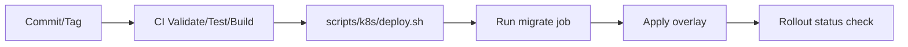

# Vývojársky sprievodca

Praktický guide pre vývojárov pracujúcich na monorepe `cistafirma`.

## 1. Predpoklady

- Docker Desktop + `docker compose`
- Node.js 20+
- Python 3.12+
- (voliteľne) `kubectl`, `helm` pre deployment validácie

## 2. Lokálny setup

### Krok 1: Konfigurácia prostredia

```bash
# z root adresára projektu
cp .env.default .env
```

### Krok 2: Spustenie služieb

```bash
docker compose up -d
docker compose ps
```

### Krok 3: Healthcheck a smoke test

```bash
curl http://localhost:8080/healthz/
curl "http://localhost:8080/api/companies/search/?q=MARO"
```

## 3. Vývojové workflow

### Backend zmeny

1. Uprav kód v `backend/`.
2. Spusti testy.
3. Over migrácie (ak meníš modely).
4. Over endpoint manuálnym requestom.

Príklad:

```bash
cd backend
python manage.py test --verbosity=1
```

### Frontend zmeny

```bash
cd frontend
npm install
npm run dev
npm run build
```

## 4. Asynchrónne úlohy (Celery)

Docker Compose spúšťa:

- `celery_worker` – konzumuje všetky queues (`celery`, `ruz_full`, `orsr`, `financials`, `insurance`).
- `celery_beat` – scheduler periodických úloh.

Manuálne trigger endpointy:

- `/api/registers/trigger-ruz-fetch/`
- `/api/registers/trigger-insurance-debt-check/`
- `/api/registers/trigger-fs-update/`

## 5. CI quality gates

Pipeline (`.gitlab-ci.yml`) obsahuje:

| Job | Čo robí |
|---|---|
| `backend_validate` | Kontrola kompilácie |
| `frontend_validate` | Frontend build |
| `docs_audit` | Validácia Markdown odkazov |
| `helm_render_validate` | Helm lint + render |
| `helm_k8s_validate` | kubectl dry-run validácie |
| `backend_tests` | Django testy |

## 6. Deploy workflow (K8s)

- Pre dev/prod deploy sa používajú `scripts/k8s/*.sh`.
- Migrácia DB sa vykonáva pred rolloutom deploymentov.
- Detailný postup, rollback a triage je v [`DEPLOYMENT_RUNBOOK.md`](DEPLOYMENT_RUNBOOK.md).



## 7. Najčastejšie príkazy

```bash
# Logy
docker compose logs -f backend
docker compose logs -f celery_worker celery_beat

# Django inside container
docker compose exec backend python manage.py migrate --settings=backend.settings
docker compose exec backend python manage.py createsuperuser --settings=backend.settings

# Reset stacku
docker compose down
docker compose up -d
```

## 8. Troubleshooting

### Frontend nevie volať backend

- Skontroluj, či backend beží: `docker compose ps`.
- Skontroluj `http://localhost:8080/healthz/`.
- Skontroluj browser console + network tab.

### Celery úlohy sa nespracúvajú

- Skontroluj `redis` service.
- Skontroluj worker logy: `docker compose logs -f celery_worker`.
- Over env premenné `CELERY_BROKER_URL` a `CELERY_RESULT_BACKEND`.

### Migrácia/deploy problém na K8s

- Skontroluj migrate job logy.
- Over `KUBE_CONFIG` v CI.
- Spusti rollback script (`scripts/k8s/rollback.sh`) ak rollout zlyhal.

## 9. Dokumentačný štandard

Pri zmene API/deploy flow aktualizuj spolu s kódom aj:

- `docs/API_REFERENCE.md`
- `docs/ARCHITECTURE.md`
- `docs/DEVOPS_CICD.md`
- Root `README.md` (ak ide o user-visible zmenu)
