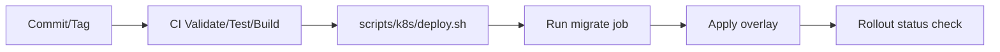

# Developer Guide

Prakticky guide pre vyvojarov pracujucich na monorepe `cistafirma`.

## 1. Predpoklady

- Docker Desktop + `docker compose`
- Node.js 20+
- Python 3.12+
- (volitelne) `kubectl`, `helm` pre deployment validacie

## 2. Lokalny setup

### Krok 1: env konfiguracia

```bash
cd /Users/samuelsugra/Code/cistafirma
cp .env.default .env
```

### Krok 2: spustenie sluzieb

```bash
docker compose up -d
docker compose ps
```

### Krok 3: healthcheck a smoke test

```bash
curl http://localhost:8080/healthz/
curl "http://localhost:8080/api/companies/search/?q=MARO"
```

## 3. Vyvojove workflowy

### Backend zmeny

1. uprav kod v `backend/`
2. spusti testy
3. over migracie (ak menis modely)
4. over endpoint manualnym requestom

Priklad:

```bash
cd /Users/samuelsugra/Code/cistafirma/backend
python manage.py test --verbosity=1
```

### Frontend zmeny

```bash
cd /Users/samuelsugra/Code/cistafirma/frontend
npm install
npm run dev
npm run build
```

## 4. Asynchronne ulohy (Celery)

Docker Compose spusta:

- `celery_worker`
- `celery_beat`

Manualne trigger endpointy:

- `/api/registers/trigger-ruz-fetch/`
- `/api/registers/trigger-insurance-debt-check/`
- `/api/registers/trigger-fs-update/`

## 5. CI quality gates

Pipeline (`.gitlab-ci.yml`) obsahuje:

- `backend_validate` - compile check
- `frontend_validate` - frontend build
- `helm_render_validate` - Helm lint + render
- `helm_k8s_validate` - kubectl dry-run validacie
- `backend_tests` - Django tests

## 6. Deploy workflow (K8s)

- pre dev/prod deploy sa pouzivaju `scripts/k8s/*.sh`
- migracia DB sa vykonava pred rolloutom deploymentov
- detailny postup, rollback a triage je v `docs/DEPLOYMENT_RUNBOOK.md`



## 7. Najcastejsie commandy

```bash
# logs
cd /Users/samuelsugra/Code/cistafirma
docker compose logs -f backend
docker compose logs -f celery_worker celery_beat

# django inside container
docker compose exec backend python manage.py migrate --settings=backend.settings
docker compose exec backend python manage.py createsuperuser --settings=backend.settings

# reset stack
docker compose down
docker compose up -d
```

## 8. Troubleshooting

### Frontend nevie volat backend

- skontroluj, ci backend bezi: `docker compose ps`
- skontroluj `http://localhost:8080/healthz/`
- skontroluj browser console + network tab

### Celery ulohy sa nespracuvaju

- skontroluj `redis` service
- skontroluj worker logs
- over env pre `CELERY_BROKER_URL` a `CELERY_RESULT_BACKEND`

### Migrations/deploy issue na K8s

- skontroluj migrate job logs
- over `KUBE_CONFIG` v CI
- spusti rollback script (`scripts/k8s/rollback.sh`) ak rollout zlyhal

## 9. Dokumentacny standard

Pri zmene API/deploy flow aktualizuj spolu s kodom aj:

- `docs/API_REFERENCE.md`
- `docs/ARCHITECTURE.md`
- `docs/DEVOPS_CICD.md`
- root `README.md` (ak ide o user-visible zmenu)
