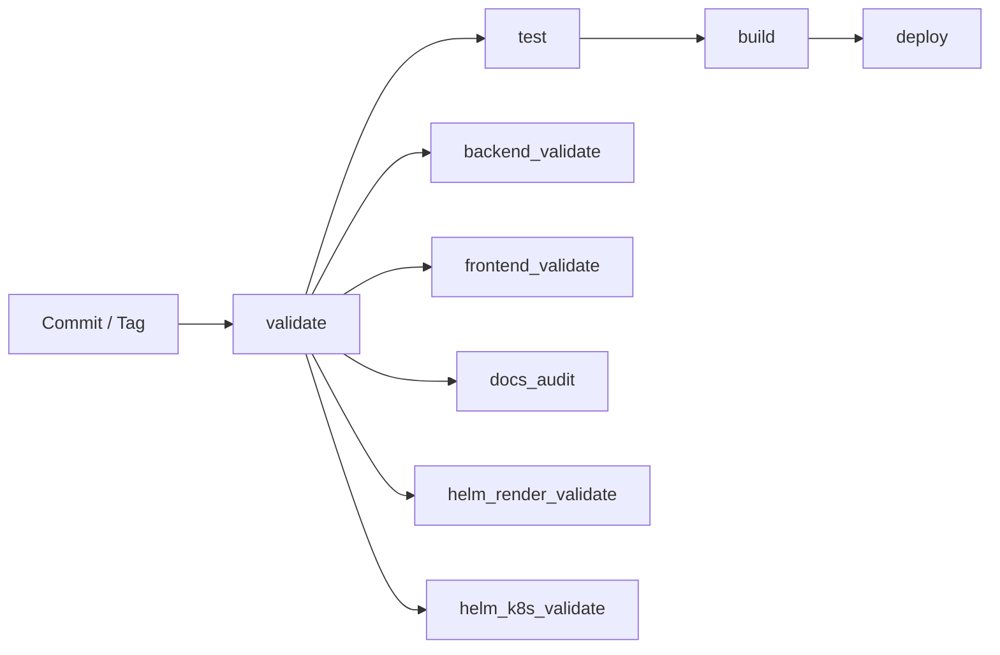
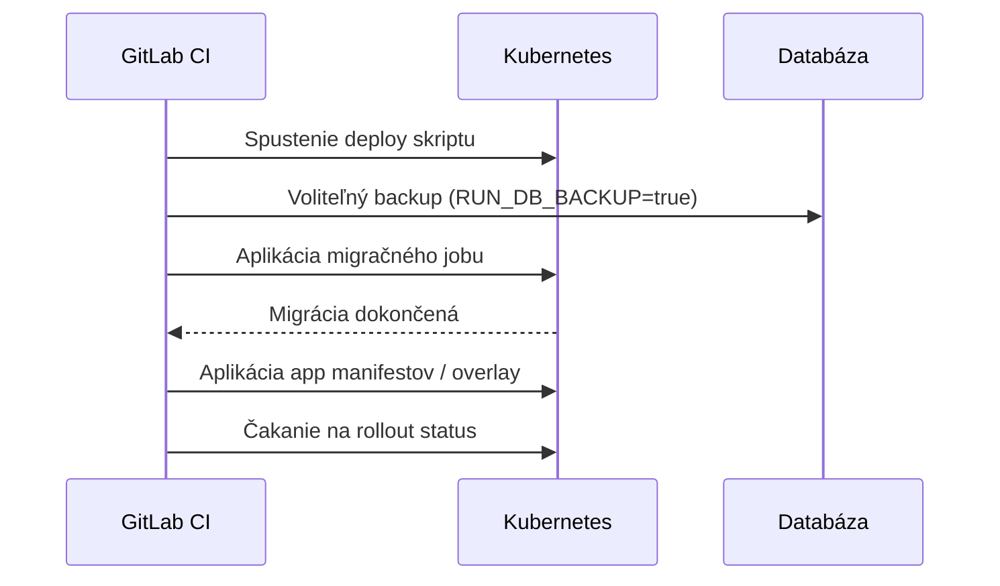

# DevOps / CI·CD dokumentácia

Tento dokument popisuje aktuálny release a deployment tok projektu `cistafirma`.

## Git stratégia

- `main` – produkčne pripravená vetva.
- `dev` – integračná vetva pre aktívny vývoj.
- Release cez tagy: `vX.Y.Z`.

Odporúčané názvy vetiev:

- `feature/<scope>-<name>`
- `hotfix/<scope>-<name>`

Promočný model:

1. Feature → merge do `dev`.
2. Testovanie v dev prostredí.
3. Merge `dev` → `main`.
4. Vytvorenie tagu `vX.Y.Z` na `main`.
5. Manuálny produkčný deploy z tag pipeline.

## Fázy pipeline

Definované v [`.gitlab-ci.yml`](../.gitlab-ci.yml):

1. **`validate`**
   - `backend_validate` – kontrola backend kompilácie.
   - `frontend_validate` – frontend build kontrola.
   - `docs_audit` – validácia interných Markdown odkazov.
   - `helm_render_validate` – Helm lint + render pre dev/prod values.
   - `helm_k8s_validate` – Kubernetes dry-run validácia (`client` vždy, `server` ak je `KUBE_CONFIG`).
2. **`test`**
   - `backend_tests` – Django test suite.
3. **`build`**
   - `build_backend_image` – build + push backend image (len `dev`, `main` a `v*` tagy).
   - `build_frontend_image` – build + push frontend image (len `dev`, `main` a `v*` tagy).
4. **`deploy`**
   - `deploy_dev` – automatický deploy do dev pre vetvu `dev`.
   - `deploy_main_to_dev` – manuálny deploy z `main` do dev prostredia.
   - `deploy_prod` – manuálny deploy do produkcie pre `v*` tagy.



## Bezpečný tok migrácií databázy

Každý deploy ide v tomto poradí:

1. Voliteľný DB backup (`RUN_DB_BACKUP=true`).
2. Migračný job na novom backend image.
3. Rollout aplikačných deploymentov.

Prečo je to tak:

- Aplikácia nespustí staré schéma proti novému kódu.
- Migrácie sú explicitné a auditovateľné.
- Rollback app vrstvy je rýchlejší; DB restore iba keď je naozaj potrebný.



## Rollback playbook

1. Rollback app vrstvy:

```bash
scripts/k8s/rollback.sh
```

2. Ak je nutný schéma/data rollback, potom DB restore:

```bash
scripts/k8s/restore_postgres.sh
```

Podrobný prevádzkový postup: [`DEPLOYMENT_RUNBOOK.md`](DEPLOYMENT_RUNBOOK.md)

## Povinné CI premenné

| Premenná | Popis |
|---|---|
| `CI_REGISTRY_USER` | Registry používateľ (automaticky z GitLab) |
| `CI_REGISTRY_PASSWORD` | Registry heslo (automaticky z GitLab) |
| `KUBE_CONFIG` | Base64 kubeconfig; povinné pre deploy joby a Helm `server` dry-run |
| `STRICT_K8S_VALIDATION` | Voliteľné; `true` = fail ak server dry-run nemôže bežať |

Voliteľné pre DB backup v pipeline:

- `DB_HOST`, `DB_PORT`, `DB_NAME`, `DB_USER`, `DB_PASSWORD`

## Helm validačné príkazy (lokálne)

```bash
cd deploy/helm/cistafirma
helm lint .
helm template cistafirma-dev . -f values.yaml -f values-dev.yaml --namespace cistafirma-dev > /tmp/cistafirma-dev-render.yaml
helm template cistafirma-prod . -f values.yaml -f values-prod.yaml --namespace cistafirma > /tmp/cistafirma-prod-render.yaml
kubectl apply --dry-run=client -f /tmp/cistafirma-dev-render.yaml
kubectl apply --dry-run=client -f /tmp/cistafirma-prod-render.yaml
kubectl apply --dry-run=server -f /tmp/cistafirma-dev-render.yaml
kubectl apply --dry-run=server -f /tmp/cistafirma-prod-render.yaml
```

### CI validačné joby

- **`helm_render_validate`**
  - Spustí `helm lint`.
  - Vyrenderuje dev/prod manifesty.
  - Overí, že Helm release obsahuje backend, frontend, presne jeden Celery Beat
    a consumera pre každú povinnú queue.
  - Uloží render artefakty pre nasledujúci job.
- **`helm_k8s_validate`**
  - Použije render artefakty.
  - Spustí `kubectl --dry-run=client` pre oba manifesty.
  - Spustí `kubectl --dry-run=server`, ak je dostupný cluster context.
  - Failne pri `STRICT_K8S_VALIDATION=true`, ak server validáciu nevie spustiť.

## Správanie release

| Vetva / Tag | Správanie |
|---|---|
| `dev` | Automatický deploy do dev prostredia. |
| `main` | Build artefaktov + manuálny gate pre deploy do dev. |
| `vX.Y.Z` tag | Manuálny gate pre produkčný deploy. |

## Ďalšie odporúčané hardening kroky

Pred zmenou produkčného deployu z Kustomize na Helm musí byť splnený
[`DEPLOYMENT_CONTRACT.md`](DEPLOYMENT_CONTRACT.md). Helm je zvolený cieľový
kompletný runtime kontrakt; Kustomize nesmie byť odstránený ani Helm nesmie byť
zapnutý pre živý deploy bez kontroly Secretov, backing služieb a existujúcich
perzistentných dát.

- Doplniť SAST/dependency scanning.
- Doplniť smoke testy po deployi.
- Vynútiť protected tagy pre produkčné releasy.
- Presunúť secrets do Vault / SealedSecrets / ExternalSecrets.
