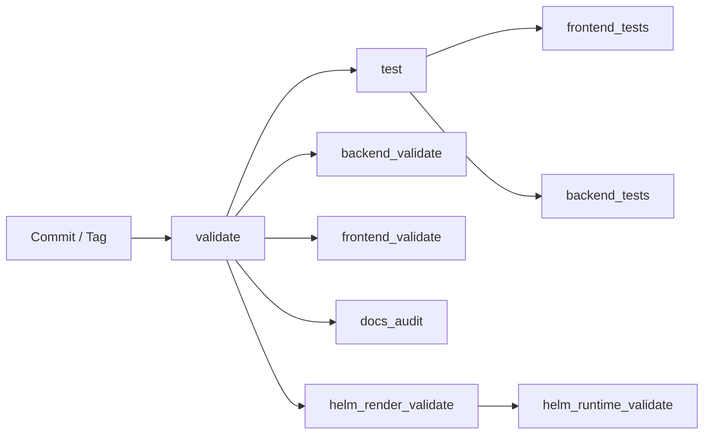

# DevOps / CI·CD dokumentácia

Tento dokument popisuje **skutočný** release a deployment tok projektu
`cistafirma` — nie cieľový stav. Pre K8s/Helm budúcnosť (ktorá dnes
nenasadená nie je a vedome sme ju odložili) platí
[`DEPLOYMENT_CONTRACT.md`](DEPLOYMENT_CONTRACT.md); tento dokument opisuje, čo
beží.

## Rozdelenie strojov

| Stroj | Rola |
|---|---|
| **Mac** (MacBook) | Iba vývoj. **Nemá GitLab runner** — bol odstránený 15. 9. 2026. |
| **lenovo** | Beží GitLab (`gitlab.home.arpa:8088`) **aj CI runner**, ktorý spúšťa joby. |
| **dell** | Produkcia. Beží `docker-compose.yml` + `docker-compose.prod.yml`. **Zámerne bez runnera.** |

Prečo dell nemá runner: je to produkcia s neopraviteľným volume
`cistafirma_postgres_data`, bežia tam rate-limitované Celery workery a runner
s prístupom k Docker socketu by len rozšíril útočnú plochu o stroj, na ktorom
záleží najviac. Build ani deploy tam nepotrebujeme — pozri „Prečo tu nie je
build ani deploy".

## Git stratégia

- `main` – produkčne pripravená vetva.
- `dev` – integračná vetva pre aktívny vývoj.
- Release cez tagy: `vX.Y.Z`.

Odporúčané názvy vetiev:

- `feature/<scope>-<name>`
- `hotfix/<scope>-<name>`

Promočný model:

1. Feature → merge do `dev`.
2. Testovanie v dev prostredí.
3. Merge `dev` → `main`.
4. Vytvorenie tagu `vX.Y.Z` na `main`.

**Nasadenie je manuálny krok** — pozri „Ako sa dnes nasadzuje".

## Fázy pipeline

Definované v [`.gitlab-ci.yml`](../.gitlab-ci.yml). Sú dve, a to je celé:

1. **`validate`**
   - `backend_validate` – `python -m compileall backend` v `python:3.12-slim`.
   - `frontend_validate` – `npm ci && npm run build` v `node:20-alpine`.
   - `docs_audit` – validácia interných Markdown odkazov.
   - `helm_render_validate` – `helm lint` + render dev/prod manifestov
     (`alpine/helm:3.17.2`); rendery idú ako artefakt ďalej.
   - `helm_runtime_validate` – kontrola vyrenderovaného manifestu
     (`python:3.12-slim`): backend, frontend, práve jeden Celery Beat a worker
     pre každú z piatich front. Beží **v inom obraze než render**, lebo
     `alpine/helm` python3 nemá.
2. **`test`**
   - `frontend_tests` – `npm test` (Vitest) + `npm run typecheck`.
   - `backend_tests` – Django test suite.



`workflow.rules` púšťa pipeline pre každú vetvu aj každý tag. Každý job má
vlastné `rules`, takže pipeline sa dá spustiť aj ručne z UI.

### Kde pipeline beží

Na **lenovo**, ako *projektový* runner `sam-lenovo` (id 1) pre `cistafirma.sk`.
`.gitlab-ci.yml` nemá v žiadnom jobe `tags:`, takže runner musí mať
**`run_untagged = true`**. To je nastavenie **na serveri GitLabu**, nie
v `config.toml`:

```bash
ssh lenovo 'docker exec gitlab-server gitlab-rails runner \
  "Ci::Runner.find(1).update!(run_untagged: true)"'
```

> **Toto je presne miesto, kde sa 11. 9. 2026 CI potichu zastavilo.** Oba
> vtedajšie runnery mali `run_untagged = false` a žiadny job v histórii repa
> nemal `tags:` — takže **žiadny job nemal kto prevziať**. Pipeline sa
> spúšťala, joby ostávali `pending`, a nikto si to štyri dni nevšimol.
> V `config.toml` je `run_untagged` pre **už registrovaný** runner inertný —
> runner ho posiela len pri registrácii. Overené 15. 9. 2026: po reštarte
> s `run_untagged = true` v configu ostal v GitLabe stav `false`
> (`ci_runners.updated_at` sa nepohol).

Bezpečnostný model runnera (socket proxy, neprivilegované job kontajnery,
`allowed_images`, pamäťové limity) je v `/home/sam/gitlab-runner/README.md` na
lenovo — `config.toml` je **generovaný** skriptom
`/home/sam/gitlab-runner/setup-config.sh`, ktorý je jediným zdrojom pravdy.

## Prečo tu nie je `build` ani `deploy`

Stages `build` a `deploy` aj s celým obsahom (`.build_template`,
`build_backend_image`, `build_frontend_image`, `.deploy_template`,
`deploy_dev`, `deploy_main_to_dev`, `deploy_prod`, `helm_k8s_validate`) boli
odstránené **15. 9. 2026**. Neboli to stratené schopnosti — boli to joby, ktoré
nemohli prejsť:

- **`build`** pushoval obrazy do GitLab registra, ktorý **nič nečíta**.
  Produkcia na delle stavia z `build:` kontextu v `docker-compose.yml`; `image:`
  sa v celom compose súbore vyskytuje len pri cudzích obrazoch (postgres,
  redis, prometheus, grafana) a dell v `.env` nemá ani jednu zmienku
  o registri. Jediný teoretický konzument bol Helm chart, ktorého values
  ukazujú na `registry.example.com` — placeholder, ktorý neexistuje.
  Navyše build potrebuje `docker:dind`, teda privileged kontajner, čo runner
  na lenovo zámerne nevie.

- **`deploy`** nepodmienene robil `echo "$KUBE_CONFIG" | base64 -d >
  ~/.kube/config`, ale `KUBE_CONFIG` nie je definovaná nikde (projekt, skupina,
  inštancia). K8s klaster nemáme. Job teda nemal ako prejsť.

- **`helm_k8s_validate`** — `kubectl apply --dry-run=client` aj tak robí
  discovery voči API serveru, takže bez klastra neprejde. A jeho obraz
  `bitnami/kubectl:1.30` na Docker Hube **neexistuje** (Bitnami presunul free
  obrazy do `bitnamilegacy`) — padol by na pull image na akomkoľvek runneri.

Job, ktorý nemôže prejsť, učí ľudí ignorovať červenú — a to je presne trieda
chyby, ktorá nechala CI štyri dni mŕtve. Zelená pipeline má cenu len vtedy, keď
červená niečo znamená.

## Ako sa dnes nasadzuje

Nasadenie je **manuálne a zámerne jednoduché**. CI mu nepredchádza bránou —
podmienkou je zelená pipeline a commit, ktorý je pushnutý na `gitlab-home`.

Kanonický remote je **`gitlab-home`** (`ssh://git@gitlab.home.arpa:2222/web/cistafirma.sk.git`).
Na delle nevolaj `git pull` bez mena remote — globálny gitconfig tam má
`fetch.all = true`, takže fetch sa pokúsi aj o `origin` (GitHub) bez
prihlásenia, príkaz skončí s exit kódom 1 a **nič neurobí**. Vždy menuj
`gitlab-home` a kontroluj exit kód, nie výstup.

```bash
# na delle
cd <repo>
git pull gitlab-home <vetva>          # over exit kód!
docker compose up -d --build          # NIKDY s -v
docker compose exec backend python manage.py migrate
```

`docker compose up -d --build` **nikdy** nedostane `-v` — to by zničilo volume
`cistafirma_postgres_data`. Platí celý zoznam zákazov z
[`DATA_PROTECTION.md`](DATA_PROTECTION.md).

### Migrácie

Migrácie **nie sú** súčasťou `up` — compose ich zámerne nespúšťa automaticky.
Poradie je: `up -d --build` → `migrate`. Pred migráciou, ktorá vyzerá
schéma-meniacne, platí `make db-backup` + `make db-backup-verify`.

### Rollback

Rollback je dnes `git checkout` predchádzajúceho commitu + `docker compose up -d
--build`. Pre dátovú vrstvu je to restore zálohy podľa
[`DATA_PROTECTION.md`](DATA_PROTECTION.md) — **nikdy** restore nad bežiacu
databázu.

K8s rollback skripty (`scripts/k8s/rollback.sh`, `scripts/k8s/restore_postgres.sh`)
a [`DEPLOYMENT_RUNBOOK.md`](DEPLOYMENT_RUNBOOK.md) opisujú **nenasadenú**
K8s cestu. Nepoužívaj ich, kým neexistuje klaster.

## CI premenné

Pipeline dnes **nepotrebuje žiadnu povinnú CI premennú.** Registračné údaje
(`CI_REGISTRY_*`), `KUBE_CONFIG`, `DB_*` ani `STRICT_K8S_VALIDATION` sa už
nepoužívajú — obsluhovali odstránené joby.

Premenné, ktoré pipeline používa, sú v `.gitlab-ci.yml`: `GIT_STRATEGY: clone`
(čistý klon pre každý job) a `DEBUG: "true"` pre `backend_tests`.

## Helm validačné príkazy (lokálne)

Presne to, čo robí CI — dá sa pustiť aj ručne:

```bash
cd deploy/helm/cistafirma
helm lint .
helm template cistafirma-dev . -f values.yaml -f values-dev.yaml --namespace cistafirma-dev > /tmp/cistafirma-dev-render.yaml
helm template cistafirma-prod . -f values.yaml -f values-prod.yaml --namespace cistafirma > /tmp/cistafirma-prod-render.yaml
cd -
python3 scripts/k8s/validate_helm_runtime.py /tmp/cistafirma-dev-render.yaml
python3 scripts/k8s/validate_helm_runtime.py /tmp/cistafirma-prod-render.yaml
```

`validate_helm_runtime.py` je jediná vec, ktorá overuje, že by nasadenie podľa
chartu naozaj spustilo všetkých päť Celery workerov — chráni Helm chart ako
budúci deploy kontrakt. **Musí bežať v obraze, ktorý má python3**; v
`alpine/helm` padá na `exit 127`.

## Ďalšie odporúčané hardening kroky

- **Kontrola živosti CI.** CI zomrelo 11. 9. 2026 a štyri dni to nikto
  nezachytil, lebo nič nesleduje, či pipeline vôbec niečo spustila. Chýbajúca
  zelená pipeline je presne tá trieda chyby, ktorú tento projekt rieši inde.
- Doplniť SAST/dependency scanning.
- Doplniť smoke testy po nasadení.
- Vynútiť protected tagy pre produkčné releasy.
- Presunúť secrets do Vault / SealedSecrets / ExternalSecrets.
- Zvážiť `tags:` v `.gitlab-ci.yml` — dnes je runner povolený na untagged joby
  serverovým prepínačom. Explicitný tag na joboch by bol viditeľnejší
  a prežil by prenos projektu inam.
