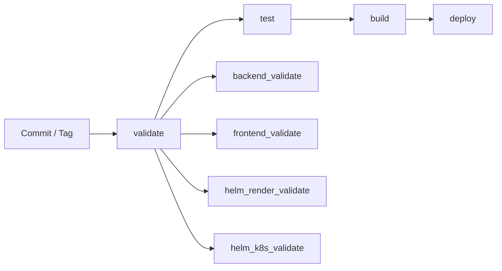
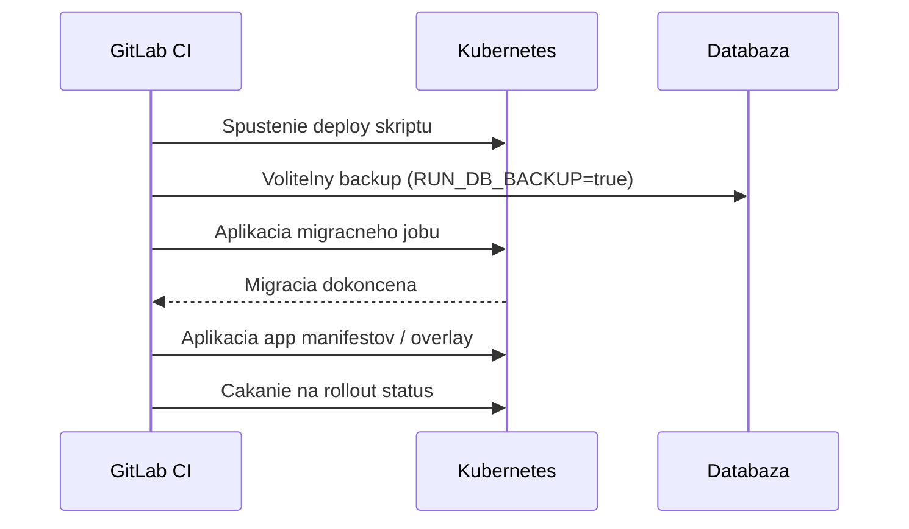

# DevOps / CI-CD dokumentacia

Tento dokument popisuje aktualny release a deployment tok projektu `cistafirma`.

## Git strategia

- `main`: produkcne pripravena vetva
- `dev`: integracna vetva pre aktivny vyvoj
- release cez tagy: `vX.Y.Z`

Odporucane nazvy vetiev:

- `feature/<scope>-<name>`
- `hotfix/<scope>-<name>`

Promocny model:

1. feature -> merge do `dev`
2. testovanie v dev prostredi
3. merge `dev` -> `main`
4. vytvorenie tagu `vX.Y.Z` na `main`
5. manualny produkcny deploy z tag pipeline

## Fazy pipeline

Definovane v [`.gitlab-ci.yml`](../.gitlab-ci.yml):

1. `validate`
   - kontrola backend kompilacie
   - frontend build kontrola
   - `helm_render_validate`: Helm lint + render pre dev/prod values
   - `helm_k8s_validate`: Kubernetes dry-run validacia (`client` vzdy, `server` ak je `KUBE_CONFIG`)
2. `test`
   - Django test suite
3. `build`
   - build + push backend image
   - build + push frontend image
4. `deploy`
   - auto deploy do dev pre vetvu `dev`
   - manualny deploy do produkcie pre `v*` tagy



## Bezpecny tok migracii databazy

Kazdy deploy ide v tomto poradi:

1. volitelny DB backup (`RUN_DB_BACKUP=true`)
2. migracny job na novom backend image
3. rollout aplikacnych deploymentov

Preco je to tak:

- aplikacia nespusti stare schema proti novemu kodu
- migracie su explicitne a auditovatelne
- rollback app vrstvy je rychlejsi, DB restore iba ked je naozaj potrebny



## Rollback playbook

1. rollback app vrstvy:

```bash
scripts/k8s/rollback.sh
```

2. ak je nutny schema/data rollback, potom DB restore:

```bash
scripts/k8s/restore_postgres.sh
```

Podrobny prevadzkovy postup: [`docs/DEPLOYMENT_RUNBOOK.md`](DEPLOYMENT_RUNBOOK.md)

## Povinne CI premenne

- `CI_REGISTRY_USER`
- `CI_REGISTRY_PASSWORD`
- `KUBE_CONFIG` (base64 kubeconfig, povinne pre deploy joby a Helm `server` dry-run)
- `STRICT_K8S_VALIDATION` (volitelne; `true` = fail ak server dry-run nemoze bezat)

Volitelne pre DB backup v pipeline:

- `DB_HOST`, `DB_PORT`, `DB_NAME`, `DB_USER`, `DB_PASSWORD`

## Helm validacne prikazy (lokalne)

```bash
cd deploy/helm/cistafirma
helm lint .
helm template cistafirma-dev . -f values.yaml -f values-dev.yaml --namespace cistafirma-dev > /tmp/cistafirma-dev-render.yaml
helm template cistafirma-prod . -f values.yaml -f values-prod.yaml --namespace cistafirma > /tmp/cistafirma-prod-render.yaml
kubectl apply --dry-run=client -f /tmp/cistafirma-dev-render.yaml
kubectl apply --dry-run=client -f /tmp/cistafirma-prod-render.yaml
kubectl apply --dry-run=server -f /tmp/cistafirma-dev-render.yaml
kubectl apply --dry-run=server -f /tmp/cistafirma-prod-render.yaml
```

### CI validacne joby

- `helm_render_validate`
  - spusti `helm lint`
  - vyrenderuje dev/prod manifesty
  - ulozi render artefakty pre nasledujuci job
- `helm_k8s_validate`
  - pouzije render artefakty
  - spusti `kubectl --dry-run=client` pre oba manifesty
  - spusti `kubectl --dry-run=server`, ak je dostupny cluster context
  - failne pri `STRICT_K8S_VALIDATION=true`, ak server validaciu nevie spustit

## Spravanie release

- `dev` vetva: automaticky deploy do dev prostredia
- `main` vetva: build artefaktov bez automatickeho produkcneho deploya
- `vX.Y.Z` tag: manualny gate pre produkcny deploy

## Dalsie odporucane hardening kroky

- doplnit SAST/dependency scanning
- doplnit smoke testy po deployi
- vynutit protected tagy pre produkcne releasy
- presunut secrets do Vault/SealedSecrets/ExternalSecrets
