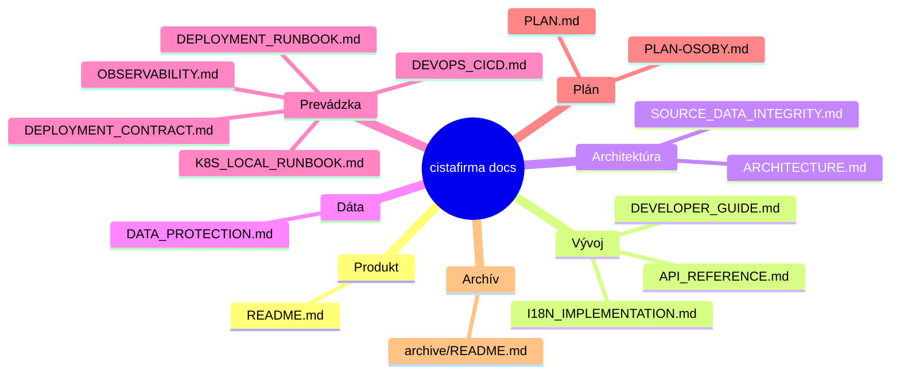

# Dokumentácia projektu `cistafirma`

Toto je centrálny vstupný bod dokumentácie pre backend, frontend, dátovú synchronizáciu a deployment.

## Obsah

| Dokument | Popis |
|---|---|
| [`ARCHITECTURE.md`](ARCHITECTURE.md) | Systémová architektúra, komponenty, async pipeline, Mermaid diagramy |
| [`API_REFERENCE.md`](API_REFERENCE.md) | Aktuálne API endpointy, auth flow, príklady request/response |
| [`DEVELOPER_GUIDE.md`](DEVELOPER_GUIDE.md) | Lokálny setup, vývojový workflow, testovanie, troubleshooting |
| [`DATA_PROTECTION.md`](DATA_PROTECTION.md) | Dátová bezpečnosť, zálohy, RPO/RTO, incident response — **čítaj pred každým Docker/príkazy nad dátami** |
| [`SOURCE_DATA_INTEGRITY.md`](SOURCE_DATA_INTEGRITY.md) | Integrita zdrojových dát: pokrytie, heuristiky, klasifikácia |
| [`OBSERVABILITY.md`](OBSERVABILITY.md) | Logy, `/metrics`, Prometheus/Grafana, čo zámerne nie je implementované |
| [`DEVOPS_CICD.md`](DEVOPS_CICD.md) | Pipeline, branch/tag stratégia, deployment a rollback |
| [`DEPLOYMENT_RUNBOOK.md`](DEPLOYMENT_RUNBOOK.md) | Operačný deploy/rollback postup, incident triage, backup/restore |
| [`DEPLOYMENT_CONTRACT.md`](DEPLOYMENT_CONTRACT.md) | Kontrakt pre **nenasadenú** K8s cestu — neriadiť sa, kým neexistuje klaster |
| [`K8S_LOCAL_RUNBOOK.md`](K8S_LOCAL_RUNBOOK.md) | Lokálny Kubernetes setup na Docker Desktop |
| [`I18N_IMPLEMENTATION.md`](I18N_IMPLEMENTATION.md) | i18n: gettext, stav prekladov, postup — **väčšinou návod, nie opis stavu** |
| [`GITFLOW.md`](GITFLOW.md) | Pravidlá prispievania a MR štandard |
| [`INTEGRATION_CHECKLIST.md`](INTEGRATION_CHECKLIST.md) | Checklist pre-push cleanupu a integrácie |
| [`PLAN.md`](PLAN.md) | Plán prác, merania, **nálezy z konsolidácie dokumentácie** a nemenné pravidlá |
| [`PLAN-OSOBY.md`](PLAN-OSOBY.md) | Plán prác na osobných väzbách (`connections`) |
| [`archive/README.md`](archive/README.md) | Archivované a historické dokumenty — nie sú zdrojom pravdy |

## Rýchla orientácia



## Kde hľadať čo

- Ak ideš implementovať feature → začni v `DEVELOPER_GUIDE.md`.
- Ak potrebuješ endpoint alebo payload → otvor `API_REFERENCE.md`.
- Ak riešiš async úlohy, queue, sync → pozri `ARCHITECTURE.md`.
- Ak sa chystáš spustiť Docker, restore alebo čokoľvek nad dátami → **najprv
  `DATA_PROTECTION.md`**.
- Ak riešiš pokrytie alebo klasifikáciu zdrojových dát → `SOURCE_DATA_INTEGRITY.md`.
- Ak riešiš logy, metriky alebo alerting → `OBSERVABILITY.md`.
- Ak riešiš release/deploy → pozri `DEVOPS_CICD.md`.
- Ak riešiš incident alebo rollback → pozri `DEPLOYMENT_RUNBOOK.md`.
- Ak nastavuješ lokálny K8s → pozri `K8S_LOCAL_RUNBOOK.md`.
- Ak hľadáš, prečo je niečo v repozitári tak, ako je → `PLAN.md` (a jeho § 8 pre
  tvrdenia zo starých dokumentov, ktoré kód nepotvrdzuje).

## Audit dokumentácie

Pred releaseom alebo väčším MR spusti audit interných odkazov:

```bash
# z root adresára projektu
make docs-audit
```

## Rozsah a garancia

Obsah je zosynchronizovaný so stavom kódu v repozitári k aktuálnemu commitu. Pri väčších zmenách API alebo deployment flow odporúčame upraviť dokumentáciu v rovnakom MR.
