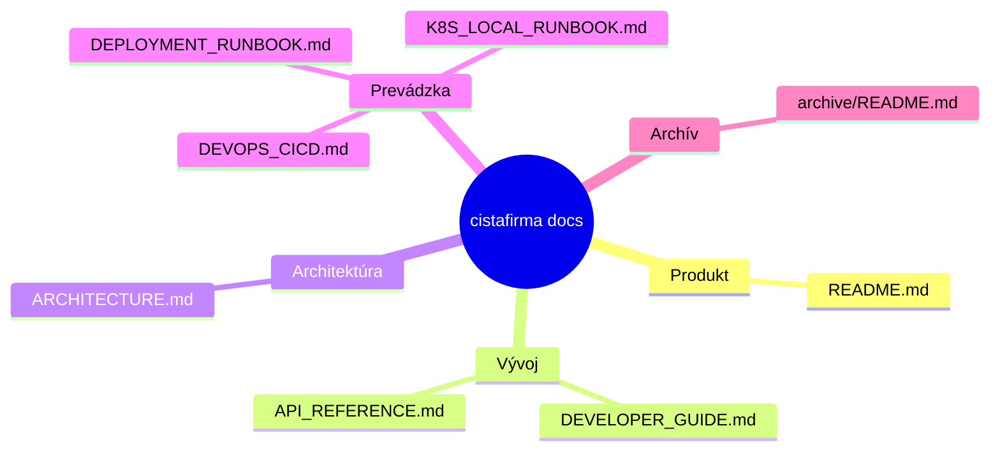

# Dokumentácia projektu `cistafirma`

Toto je centrálny vstupný bod dokumentácie pre backend, frontend, dátovú synchronizáciu a deployment.

## Obsah

| Dokument | Popis |
|---|---|
| [`ARCHITECTURE.md`](ARCHITECTURE.md) | Systémová architektúra, komponenty, async pipeline, Mermaid diagramy |
| [`API_REFERENCE.md`](API_REFERENCE.md) | Aktuálne API endpointy, auth flow, príklady request/response |
| [`DEVELOPER_GUIDE.md`](DEVELOPER_GUIDE.md) | Lokálny setup, vývojový workflow, testovanie, troubleshooting |
| [`DEVOPS_CICD.md`](DEVOPS_CICD.md) | Pipeline, branch/tag stratégia, deployment a rollback |
| [`DEPLOYMENT_RUNBOOK.md`](DEPLOYMENT_RUNBOOK.md) | Operačný deploy/rollback postup, incident triage, backup/restore |
| [`GITFLOW.md`](GITFLOW.md) | Pravidlá prispievania a MR štandard |
| [`K8S_LOCAL_RUNBOOK.md`](K8S_LOCAL_RUNBOOK.md) | Lokálny Kubernetes setup na Docker Desktop |
| [`archive/README.md`](archive/README.md) | Archivované a historické dokumenty |

## Rýchla orientácia



## Kde hľadať čo

- Ak ideš implementovať feature → začni v `DEVELOPER_GUIDE.md`.
- Ak potrebuješ endpoint alebo payload → otvor `API_REFERENCE.md`.
- Ak riešiš async úlohy, queue, sync → pozri `ARCHITECTURE.md`.
- Ak riešiš release/deploy → pozri `DEVOPS_CICD.md`.
- Ak riešiš incident alebo rollback → pozri `DEPLOYMENT_RUNBOOK.md`.
- Ak nastavuješ lokálny K8s → pozri `K8S_LOCAL_RUNBOOK.md`.

## Audit dokumentácie

Pred releaseom alebo väčším MR spusti audit interných odkazov:

```bash
# z root adresára projektu
make docs-audit
```

## Rozsah a garancia

Obsah je zosynchronizovaný so stavom kódu v repozitári k aktuálnemu commitu. Pri väčších zmenách API alebo deployment flow odporúčame upraviť dokumentáciu v rovnakom MR.
