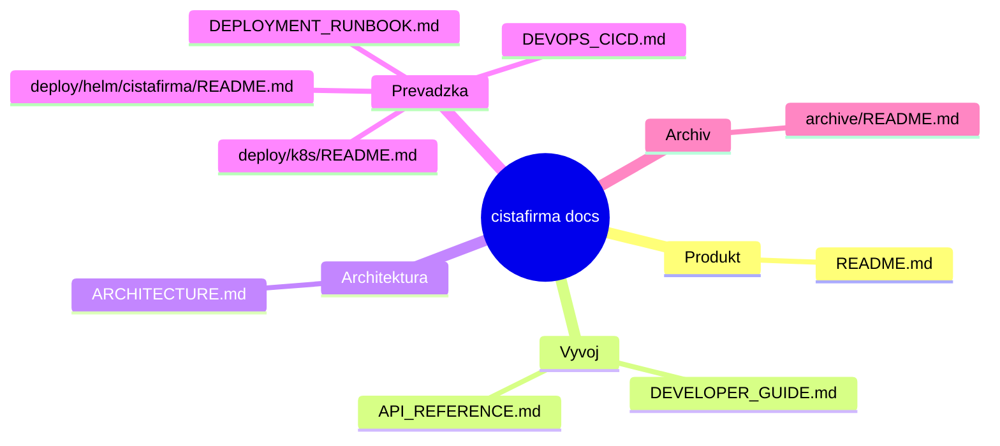

# Dokumentacia projektu `cistafirma`

Toto je centralny vstupny bod dokumentacie pre backend, frontend, data sync a deployment.

## Obsah

- [`ARCHITECTURE.md`](ARCHITECTURE.md) - systemova architektura, komponenty, async pipeline, Mermaid diagramy
- [`API_REFERENCE.md`](API_REFERENCE.md) - aktualne API endpointy, auth flow, priklady request/response
- [`DEVELOPER_GUIDE.md`](DEVELOPER_GUIDE.md) - lokalny setup, vyvojovy workflow, testovanie, troubleshooting
- [`DEVOPS_CICD.md`](DEVOPS_CICD.md) - pipeline, branch/tag strategia, deployment a rollback
- [`DEPLOYMENT_RUNBOOK.md`](DEPLOYMENT_RUNBOOK.md) - operacny deploy/rollback postup, incident triage, backup/restore
- [`../CONTRIBUTING.md`](../CONTRIBUTING.md) - pravidla prispievania a MR standard
- [`archive/README.md`](archive/README.md) - archivovane a historicke dokumenty

## Rychla orientacia



## Kde hladat co

- Ak ides implementovat feature: zacni v `DEVELOPER_GUIDE.md`
- Ak potrebujes endpoint alebo payload: otvor `API_REFERENCE.md`
- Ak riesis async ulohy, queue, sync: pozri `ARCHITECTURE.md`
- Ak riesis release/deploy: pozri `DEVOPS_CICD.md`
- Ak riesis incident alebo rollback: pozri `DEPLOYMENT_RUNBOOK.md`

## Audit dokumentacie

Pred release alebo vacsim MR spusti audit internych odkazov:

```bash
cd /Users/samuelsugra/Code/cistafirma
make docs-audit
```

## Rozsah a garancia

Obsah je zosynchronizovany so stavom kodu v repozitari k aktualnemu commitu. Pri vacsich zmenach API alebo deployment flow odporucame upravit dokumentaciu v rovnakom PR.
